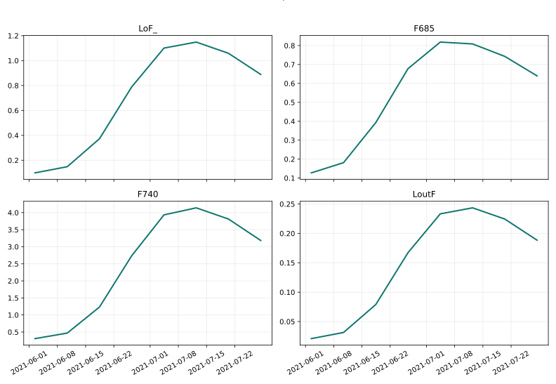
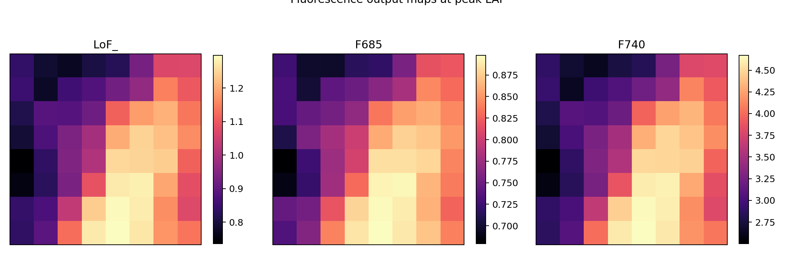
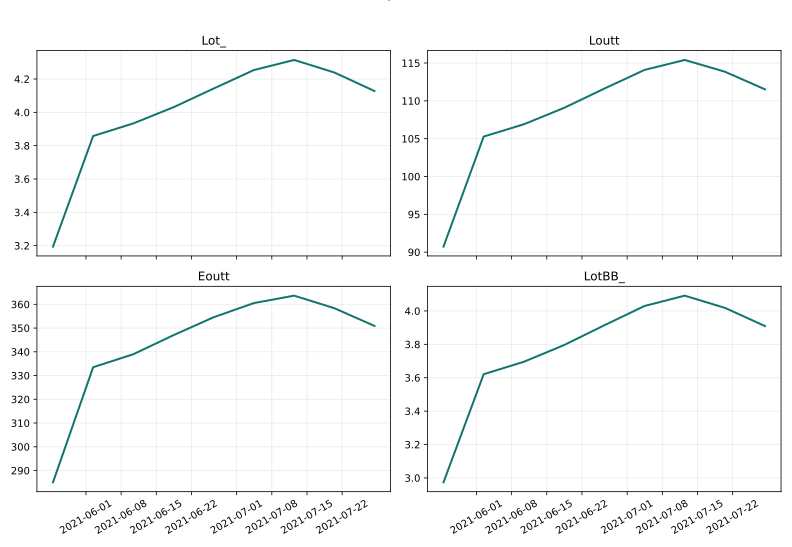
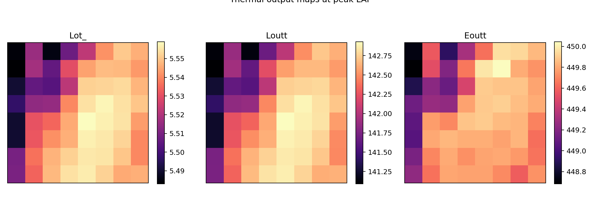
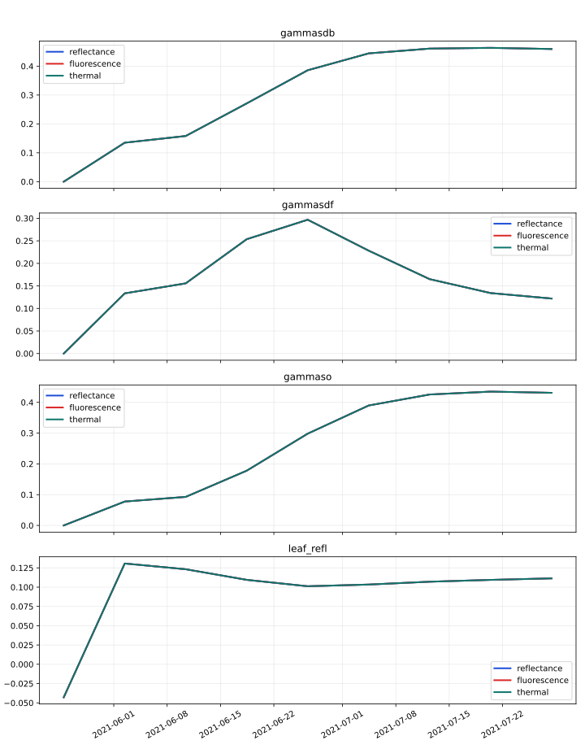

# End-to-End ARC -> SCOPE Walkthrough

This page documents the real showcase path from the beginning to the end of the pipeline: one ARC retrieval, one shared weather and geometry alignment stage, then three SCOPE workflows that produce reflectance, SIF, and thermal outputs you can browse interactively.

[Open the explorer](assets/full-run/explorer.html){ .md-button .md-button--primary }
[Quick start](quickstart.md){ .md-button }
[Installation](installation.md){ .md-button }

!!! success "What is real in this page"
    The published bundle is generated from a real ARC retrieval over the bundled Belgium field in 2021, with real acquisition dates, real forcing alignment, real SCOPE-ready inputs, and saved model outputs.

!!! info "What is compact in the published bundle"
    The GitHub Pages artifact keeps the explorer payload downsampled across spatial and spectral axes so the browser stays responsive. The figure suite and CSV inventories are generated from the actual saved run outputs.

!!! warning "What is not in the checked-in site bundle"
    The local full run writes per-workflow NetCDF inputs and outputs. Those heavy files are not checked into the docs bundle, so the published page focuses on figures, explorer payloads, and audit-friendly CSV summaries.

<div class="grid cards" markdown>

-   :material-map-marker-radius: __Scenario__

    ---

    Belgium/Flanders test field, crop type `wheat`, field-year `2021`, local weather dates `2021-05-25` to `2021-08-05`.

-   :material-layers-triple: __Model stages__

    ---

    ARC retrieval first, then forcing and geometry alignment, then SCOPE `reflectance`, `fluorescence`, and `thermal`.

-   :material-chart-box-outline: __What you can inspect__

    ---

    Seasonal trajectories, snapshot maps, pixel-level time series, selected-band traces, and full spectra at one date.

</div>

## Scenario Summary

| Setting | Value |
| --- | --- |
| Field | Bundled Belgium test field |
| Crop type | `wheat` |
| Retrieval window | `2021-05-25` to `2021-08-05` |
| Retrieval source | Sentinel-2 via ARC |
| Forcing source in published bundle | Bundled local weather CSV |
| SCOPE workflows | `reflectance`, `fluorescence`, `thermal` |
| Explorer focus | Pixel/date/band/spectrum browsing |

## Run The Same Example

=== "Pixi task"

    ```bash
    pixi install
    pixi run fetch-scope-upstream
    pixi run check-runtime
    pixi run real-experiment-docs
    ```

=== "Direct CLI"

    ```bash
    python3 -m arc_scope.experiments.dual_workflow \
      --start-date 2021-05-25 \
      --end-date 2021-08-05 \
      --weather-provider local \
      --weather-file ./src/arc_scope/data/showcase_weather.csv \
      --scope-root-path ./upstream/SCOPE \
      --workflow reflectance \
      --workflow fluorescence \
      --workflow thermal \
      --dtype float32 \
      --output-dir ./docs/assets/full-run
    ```

=== "Optional coupled energy balance"

    ```bash
    python3 -m arc_scope.experiments.dual_workflow \
      --start-date 2021-05-25 \
      --end-date 2021-08-05 \
      --weather-provider local \
      --weather-file ./src/arc_scope/data/showcase_weather.csv \
      --scope-root-path ./upstream/SCOPE \
      --workflow reflectance \
      --workflow energy-balance \
      --dtype float32 \
      --output-dir ./full-run-output-energy-balance
    ```

The published docs bundle uses the validated reflectance, fluorescence, and thermal run because it already demonstrates the full start-to-finish story with SIF and thermal signals. The coupled `energy-balance` branch is available, but it is materially heavier to regenerate.

## Start To Finish

<div class="grid cards" markdown>

-   :material-image-search: __1. Retrieve crop state__

    ---

    `retrieve_arc()` searches Sentinel-2, caches scenes, and reconstructs seasonal crop state over the field.

-   :material-swap-horizontal-bold: __2. Bridge and align__

    ---

    `bridge_arc_to_scope()`, `fetch_weather()`, and `build_observation_dataset()` convert the retrieval into SCOPE units, weather forcing, and sun-sensor geometry.

-   :material-database-cog: __3. Prepare SCOPE inputs__

    ---

    `prepare_scope_dataset()` merges the ARC state, forcing, geometry, and upstream SCOPE resources into workflow-ready datasets.

-   :material-chart-line-variant: __4. Simulate outputs__

    ---

    `run_scope_simulation()` writes the reflectance, fluorescence, and thermal datasets that feed the figures and explorer.

</div>

## Step 1: ARC Retrieval

The first stage answers a simple question: what canopy state should SCOPE simulate for each acquisition date? ARC uses the field boundary, the date window, and the crop prior to retrieve the core biophysical variables that drive canopy radiative transfer.

<div class="grid cards" markdown>

-   

    The field boundary confirms the exact target geometry passed into ARC.

-   

    The acquisition timeline shows the real Sentinel-2 dates assimilated by ARC.

</div>

<div class="grid cards" markdown>

-   

    `LAI`, `Cab`, and `Cw` define canopy density, chlorophyll content, and water content before the forward simulation stage begins.

-   

    The peak-date maps show the spatial heterogeneity that later propagates into the SCOPE outputs.

</div>

## Step 2: Weather And Observation Geometry

SCOPE needs more than crop state. It also needs the atmospheric forcing and the sun-sensor geometry for each time step.

<div class="grid cards" markdown>

-   

    `Rin` and `Rli` provide radiative forcing, while `Ta`, `ea`, `p`, and `u` describe the atmospheric state used during the run.

-   

    Solar zenith, solar azimuth, and viewing geometry come from the field centroid and the acquisition dates, so SCOPE sees the correct illumination and observation angles.

</div>

## Step 3: Prepare SCOPE Inputs

`prepare_scope_dataset()` turns the retrieved ARC state plus forcing and geometry into the input cubes that SCOPE actually consumes.


The key thing to notice here is where each family comes from:

- `LAI`, `Cab`, and `Cw` are retrieved by ARC.
- `Ta` and `Rin` come from the weather source.
- `tts` comes from the geometry builder.
- `fqe` is added for the fluorescence branch.
- `Tcu`, `Tch`, `Tsu`, and `Tsh` are added for the standalone thermal branch.

The saved inventories let you audit exactly what was present in the bundle:

- [Open `run_config.json`](assets/full-run/run_config.json)
- [Open `workflow_metrics.csv`](assets/full-run/workflow_metrics.csv)
- [Open `variable_inventory.csv`](assets/full-run/variable_inventory.csv)
- [Open `artifact_manifest.json`](assets/full-run/artifact_manifest.json)

## Step 4: Simulated Outputs

The published example runs three complementary SCOPE branches from the same prepared state.

If the page feels static here, use the direct Plotly links below. They open the same explorer already embedded later in this page, but they jump straight to the simulated output family you care about instead of starting on reflectance by default.

=== "Reflectance"

    The dedicated `reflectance` branch is the clearest way to inspect band-level and spectrum-level canopy reflectance behaviour.

    [Open interactive reflectance explorer](assets/full-run/explorer.html?key=reflectance%3Arsot){ .md-button .md-button--primary }

    

    The time-series figure surfaces the highest-signal reflectance variables from the saved dataset: `rsot`, `rso`, `rsos`, and `rsod`.

    

    The snapshot maps show how the retrieved spatial structure propagates to the simulated reflectance outputs.

=== "Fluorescence"

    The `fluorescence` branch adds the SIF-oriented signals that were missing from the earlier docs page.

    [Open interactive SIF time series](assets/full-run/explorer.html?key=fluorescence%3AF740){ .md-button .md-button--primary }
    [Open interactive SIF spectrum](assets/full-run/explorer.html?key=fluorescence%3ALoF_){ .md-button }

    

    This branch exposes outputs such as `LoF_`, `F685`, `F740`, and `LoutF`, which are the core SIF families used in the explorer.

    

    These maps show where the strongest fluorescence response appears across the field on a representative date.

=== "Thermal"

    The `thermal` branch provides the thermal radiance and emissive outputs needed for temperature-oriented browsing.

    [Open interactive thermal time series](assets/full-run/explorer.html?key=thermal%3ALoutt){ .md-button .md-button--primary }
    [Open interactive thermal spectrum](assets/full-run/explorer.html?key=thermal%3ALot_){ .md-button }

    

    This branch surfaces variables such as `Lot_`, `Loutt`, `Eoutt`, and `LotBB_`.

    

    These maps show where the warm and cool response differs spatially across the field.

=== "Shared comparison"

    

    This comparison overlays the variables shared across the saved workflow outputs so you can see where the standalone branches agree or diverge.

## Step 5: Interactive Exploration

The explorer is the main reason this page exists. It lets you move from static figures to interactive inspection of the actual saved outputs.

<div class="grid cards" markdown>

-   :material-open-in-new: __Standalone explorer__

    ---

    [Open `explorer.html`](assets/full-run/explorer.html){ .md-button }

-   :material-file-code-outline: __Browse payload__

    ---

    [Open `explorer_payload.json`](assets/full-run/explorer_payload.json)

</div>

<iframe
  src="assets/full-run/explorer.html"
  title="ARC-SCOPE interactive explorer"
  style="width: 100%; min-height: 1280px; border: 1px solid rgba(15, 23, 42, 0.12); border-radius: 18px; background: white;"
></iframe>

### Explorer Tabs

The explorer has five tabbed views, each designed for a different kind of question:

**Overview** — The default dashboard. Shows a spatial map, pixel time series for all pinned locations, a value histogram, a spectrum panel, and a statistics table. Start here to get oriented.

**Spatial** — Side-by-side maps for two dates of the same variable, plus a difference map. Use this to see how the field evolves between acquisitions or to spot spatial anomalies.

**Time Series** — Deep dive into temporal patterns. The main panel shows all pinned pixels overlaid. A multi-variable panel shows all scalar variables in the same group. A first-vs-last scatter reveals whether each pixel changed over the season.

**Spectra** — Full spectral inspection. Compare spectra across pinned pixels on one date, or compare the same pixel across multiple dates. Only active for spectral variables (rsot, LoF_, Lot_).

**Compare** — Two-variable analysis. Pick a second variable from any group and see side-by-side maps, a pixel scatter plot, and dual-axis time series. Use this to check whether LAI drives reflectance, or how SIF and thermal outputs relate.

### How to use pixel pinning

- Click any map pixel to set it as the primary pin (P0).
- Each click updates all time series, spectra, and statistics to that pixel.
- Pin up to 6 pixels to overlay their time series and spectra for comparison.
- Pins persist across tab switches so you can compare the same locations in different views.

This means the same page can answer questions like:

- How does a single reflectance band evolve through the season?
- What does the full reflectance spectrum look like on a chosen date?
- How do SIF and thermal signals differ at the same pixel?
- Where do the strongest spatial differences appear in the saved run?
- Does the pixel with peak LAI also show peak fluorescence?
- How does the spectral shape change between green-up and senescence?

## Output Bundle

The docs bundle is a browseable slice of the real run, not a hand-assembled mockup.

| File | Purpose |
| --- | --- |
| `arc_output.npz` | ARC retrieval artifact cached from the field-year run |
| `run_config.json` | Exact scenario metadata used to generate the bundle |
| `workflow_metrics.csv` | High-level summary of workflow coverage |
| `variable_inventory.csv` | Per-variable audit trail for inputs and outputs |
| `explorer.html` / `explorer_payload.json` | Interactive browser layer |
| `figures/*.svg` / `figures/*.png` | End-to-end figure suite for the published page |

The local run also writes per-workflow NetCDF inputs and outputs. Those authoritative heavy files are intentionally omitted from the checked-in Pages bundle.

## Why This Page Uses The Validated Full Run

The repository now also exposes a coupled `energy-balance` path. I did not switch the published page to that branch here because the coupled solve is materially slower to regenerate. The current checked-in bundle already satisfies the actual showcase need:

- one real location and year
- real ARC retrieval
- real SCOPE-ready inputs
- real reflectance, SIF, and thermal outputs
- figure-rich explanation
- interactive exploration of time series, spectra, and maps

That is the most reliable contract for the docs site today.
