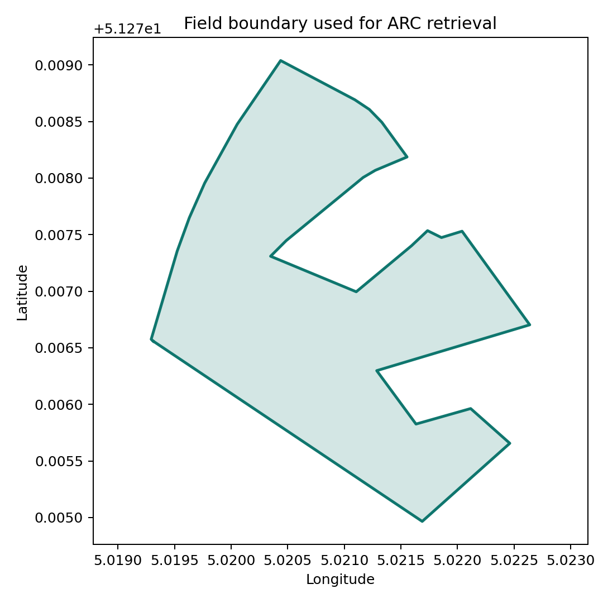
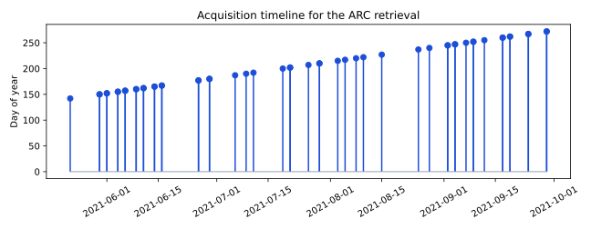
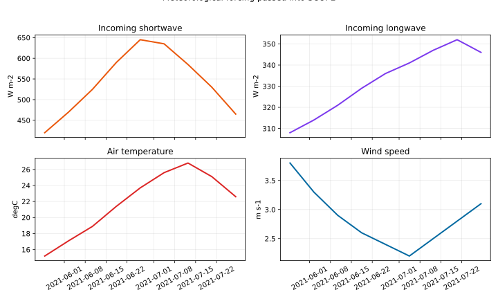
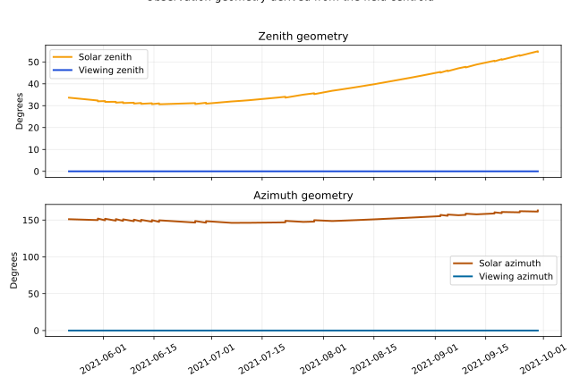
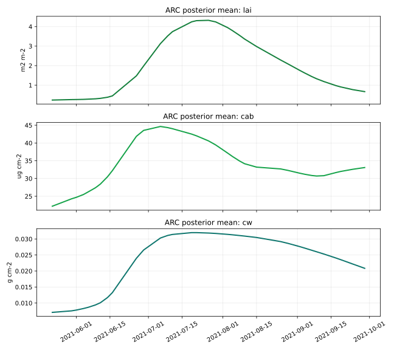
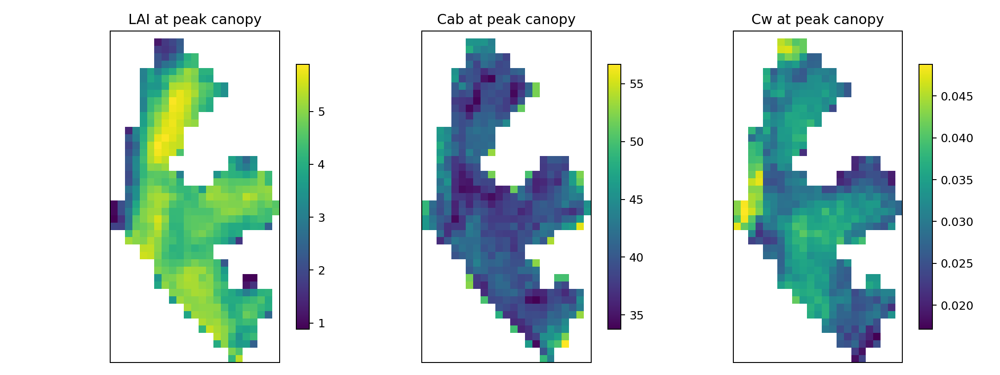
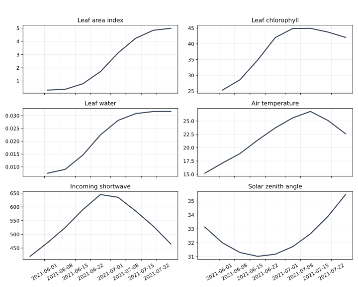
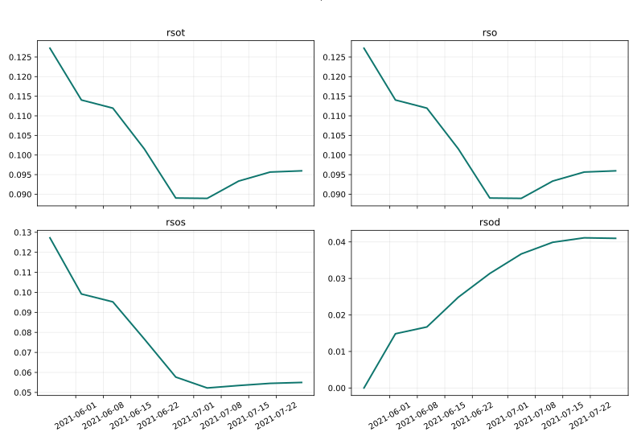
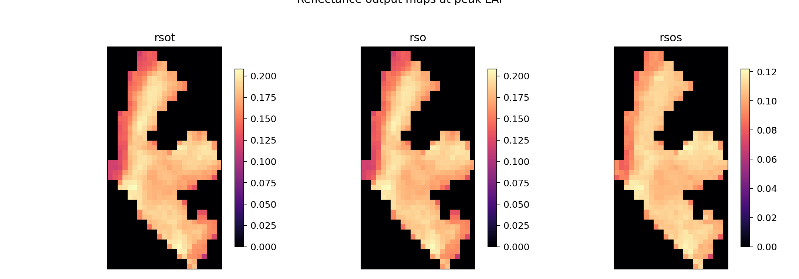

# Real ARC -> SCOPE Experiment

The heavyweight docs path is a real end-to-end ARC-to-SCOPE run over the bundled Belgium/Flanders test field in **2021**.

[Run the experiment](#run-the-experiment){ .md-button .md-button--primary }
[Quick start](quickstart.md){ .md-button }
[Installation](installation.md){ .md-button }

!!! success "Validated docs path"
    This page documents the real ARC retrieval plus the validated SCOPE `reflectance` workflow. The saved docs figures come from that real run.

!!! warning "What this page does not claim"
    Other SCOPE workflows exist in the broader package surface, but this page does **not** present `fluorescence` or `thermal` as the primary validated docs example.

<div class="grid cards" markdown>

-   :material-map-marker-radius: __Scenario__

    ---

    Belgium test field, wheat crop type, 2021 season, real ERA5 weather, and the reflectance workflow.

-   :material-database-eye: __Real inputs__

    ---

    Sentinel-2 acquisitions, ARC biophysical retrieval, observation geometry, weather forcing, and SCOPE-ready datasets.

-   :material-chart-line-variant: __Real outputs__

    ---

    Seasonal reflectance curves, spatial snapshot maps, figure bundle, and run metadata for the docs site.

</div>

## Runtime Setup

=== "Pixi"

    The fastest reproducible path in this repo:

    ```bash
    pixi install
    pixi run fetch-scope-upstream
    pixi run check-runtime
    ```

=== "Python package"

    If you want the standard extras route:

    ```bash
    pip install "arc-scope[all]"
    scope fetch-upstream --dest ./upstream/SCOPE
    ```

For ERA5 weather you also need a working `~/.cdsapirc`.

## Run The Experiment

=== "Full run"

    ```bash
    python3 -m arc_scope.experiments.dual_workflow \
      --scope-root-path ./upstream/SCOPE \
      --workflow reflectance \
      --dtype float32 \
      --output-dir ./full-run-output
    ```

=== "Runtime check only"

    ```bash
    python3 -m arc_scope.experiments.dual_workflow \
      --scope-root-path ./upstream/SCOPE \
      --check-runtime
    ```

The implementation still lives at `arc_scope.experiments.dual_workflow` for compatibility, but the public docs contract is the real reflectance-backed experiment shown here.

## Pipeline At A Glance

<div class="grid cards" markdown>

-   :material-image-search: __1. ARC retrieval__

    ---

    `retrieve_arc()` pulls Sentinel-2 observations over the field and retrieves crop biophysical state for the season.

-   :material-swap-horizontal-bold: __2. Bridge conversion__

    ---

    `bridge_arc_to_scope()` turns ARC outputs into SCOPE-shaped xarray structures with physical units and spatial coordinates.

-   :material-weather-partly-cloudy: __3. Weather forcing__

    ---

    `fetch_weather()` downloads ERA5 weather for the field and season.

-   :material-angle-acute: __4. Observation geometry__

    ---

    `build_observation_dataset()` derives solar and viewing angles from the field centroid and acquisition dates.

-   :material-database-cog: __5. Input preparation__

    ---

    `prepare_scope_dataset()` merges retrieval, forcing, geometry, and upstream SCOPE assets into one runnable dataset.

-   :material-play-circle-outline: __6. Forward simulation__

    ---

    `run_scope_simulation()` executes the real SCOPE `reflectance` workflow and produces spectral canopy outputs.

</div>

## Scenario Summary

| Setting | Value |
| --- | --- |
| Field | Bundled Belgium test field |
| Crop type | `wheat` |
| Date window | `2021-05-15` to `2021-10-01` |
| Weather provider | `era5` |
| SCOPE workflow | `reflectance` |
| Practical docs command | `--dtype float32` |

## Input Surfaces

=== "What goes in"

    | Input | Main variables | Why it matters |
    | --- | --- | --- |
    | Field boundary | GeoJSON polygon | Defines the ARC retrieval footprint and map extent |
    | Acquisition timeline | Sentinel-2 observation dates | Drives ARC assimilation and observation timestamps |
    | Weather forcing | `Rin`, `Rli`, `Ta`, `ea`, `p`, `u` | Defines the atmospheric state for SCOPE |
    | Observation geometry | solar/viewing zenith and azimuth | Defines the sun-sensor geometry |
    | ARC crop state | `LAI`, `Cab`, `Cw`, plus the broader parameter set | Controls canopy density, absorption, and water state |

=== "How to read them"

    - `LAI` controls how much canopy the light interacts with.
    - `Cab` controls chlorophyll absorption and therefore spectral response.
    - `Cw` controls leaf water content and affects water-sensitive wavelengths.
    - `Rin` and `Rli` are the incoming shortwave and longwave fluxes used during simulation.
    - `tts` comes from solar zenith angle and is one of the key geometry drivers passed into SCOPE.

## Output Surfaces

=== "Main output families"

    | Output family | Example variables | Meaning |
    | --- | --- | --- |
    | Leaf optics | `leaf_refl`, `leaf_tran` | Leaf-scale reflectance and transmittance |
    | Canopy reflectance | `rso`, `rsot` | Directional canopy reflectance outputs |
    | Spectral transport | `rdd`, `tdd`, `rdot`, `rddt` | Intermediate and directional radiative terms |

=== "Validated run summary"

    For the checked-in Belgium 2021 docs bundle, the saved SCOPE output grid is:

    - `y = 45`
    - `x = 23`
    - `time = 53`
    - `wavelength = 2001`

    The selected showcase outputs in that run are `rsot`, `rso`, `rsos`, and `rsod`.

## Output Bundle

The local heavy run writes a report-style artifact directory with retrieval products, forcing products, SCOPE input/output datasets, CSV inventories, and a generated Markdown report.

The GitHub Pages docs bundle keeps only the lightweight files needed for the site:

- figure assets
- `run_config.json`
- `environment.json`
- `workflow_metrics.csv`
- `variable_inventory.csv`
- `acquisition_table.csv`

This keeps the docs site small while still showing real outputs from the validated run.

## Figure Gallery

### Field And Forcing

<div class="grid cards" markdown>

-   __Field boundary__

    ---

    

    Geographic footprint used for ARC retrieval and all downstream maps.

-   __Acquisition timeline__

    ---

    

    Sentinel-2 dates assimilated by ARC, including repeated same-day acquisitions with unique timestamps.

-   __Weather forcing__

    ---

    

    The real ERA5 forcing curves that drive the SCOPE run.

-   __Observation geometry__

    ---

    

    Solar and viewing geometry derived from the field centroid and acquisition schedule.

</div>

### Retrieval And Prepared Inputs

<div class="grid cards" markdown>

-   __ARC biophysics__

    ---

    

    Seasonal posterior trajectories before the handoff to SCOPE.

-   __ARC peak maps__

    ---

    

    Spatial heterogeneity at the peak-LAI date.

-   __SCOPE input overview__

    ---

    

    The combined handoff of crop state, forcing, and solar geometry.

</div>

### Simulated Reflectance Outputs

<div class="grid cards" markdown>

-   __Reflectance time series__

    ---

    

    High-signal reflectance outputs selected from the real saved dataset.

-   __Reflectance snapshot maps__

    ---

    

    Peak-LAI spatial response across the field after reducing the spectral dimension.

</div>

## Why This Page Matters

This page is the repo's most grounded demonstration because it shows a real field-season chain instead of a synthetic-only walkthrough:

- ARC retrieval from Sentinel-2
- weather and geometry aligned for the same season
- SCOPE-ready input preparation
- real reflectance outputs turned into figures suitable for the docs site

If you want a lighter dependency path, use the [Core Showcase](showcase-experiment.md). If you want to build your own run from lower-level pieces, use the [Quick Start](quickstart.md).
