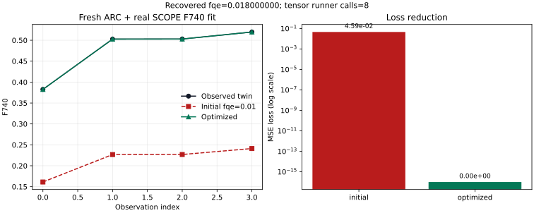
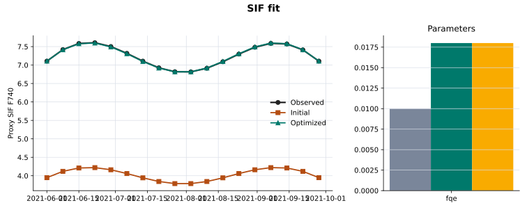
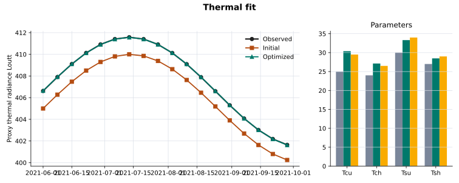
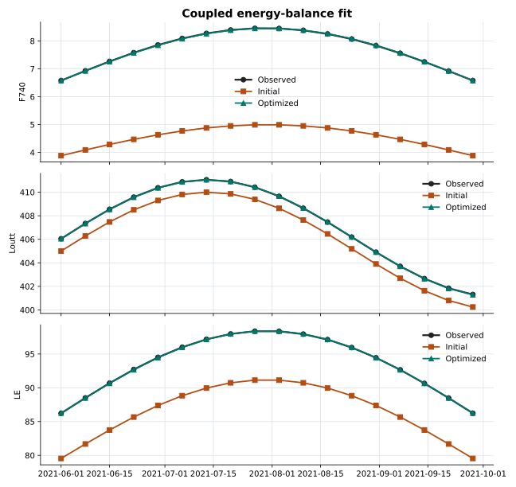
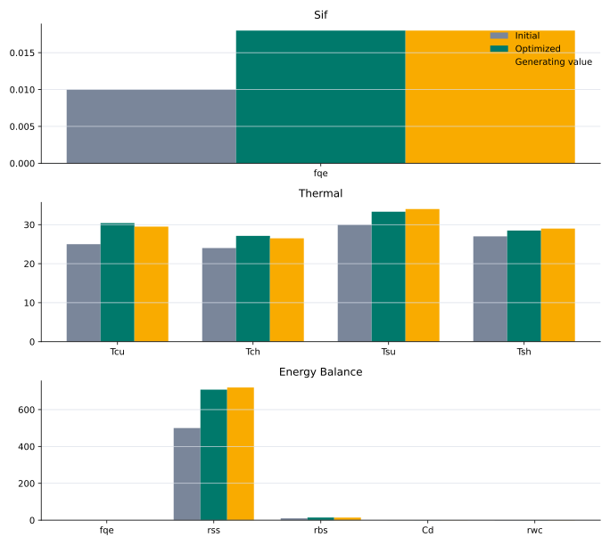

# Optimization Guide

ARC-SCOPE optimisation calibrates selected SCOPE parameters against observed
targets after ARC has retrieved the canopy state. ARC outputs such as `LAI`,
`Cab`, and `Cw` remain fixed. The optimiser changes only the parameters you
choose in `optim_config`, runs SCOPE repeatedly, and keeps the parameter values
that reduce the configured loss.

Use optimisation when you have observations that correspond to SCOPE outputs:

- SIF observations for the fluorescence workflow.
- Thermal radiance or land-surface-temperature-like observations for the thermal workflow.
- SIF, thermal, or flux observations for the coupled `energy-balance` workflow.

## What the Runner Does

When `PipelineConfig.optimize=True`, `optim_config["enabled"] = True`, or a
nested runner payload contains `optim.enabled`, `ArcScopePipeline.run()` changes
from a single forward simulation to this loop:

1. Run ARC, bridge, weather, geometry, and SCOPE input preparation as usual.
2. Load observations from `optim_config["observations"]` or `observations_path`.
3. Choose parameters from `optim_config["parameters"]`, `parameter_preset`, or the workflow default.
4. Inject trial parameter values into the prepared SCOPE input dataset.
5. Run SCOPE and compare selected output variables with observations.
6. Minimise the scalar loss with scipy.
7. Inject the optimised parameters and run one final SCOPE simulation.
8. Return the optimised input, output, and `OptimizationResult`.

!!! warning "Target names must match SCOPE output names"
    `target_variables` are SCOPE output variable names, not generic labels.
    Run a baseline simulation first and inspect `result.scope_output_ds.data_vars`
    if you are unsure which names your installed `scope-rtm` version emits.

## Shared Configuration Pattern

Every optimisation run needs observations and target variables:

```python
from arc_scope.pipeline import ArcScopePipeline, PipelineConfig

config = PipelineConfig(
    geojson_path="field.geojson",
    start_date="2021-05-15",
    end_date="2021-10-01",
    crop_type="wheat",
    start_of_season=170,
    year=2021,
    scope_workflow="fluorescence",
    scope_root_path="./upstream/SCOPE",
    optim_config={
        "enabled": True,
        "observations_path": "observed_sif.nc",
        "target_variables": ["F740"],
    },
)

result = ArcScopePipeline(config).run()
summary = result.optimization_result
```

`observations_path` should point to a NetCDF dataset with variables matching
`target_variables`. You can also pass an in-memory `xarray.Dataset`:

```python
import xarray as xr

observations = xr.Dataset(
    {"F740": ("time", observed_f740_values)},
    coords={"time": observation_times},
)

config.optim_config["observations"] = observations
```

ARC-SCOPE aligns predictions and observations by shared xarray coordinates
before comparing finite values. If a SCOPE target is gridded, for example
`(y, x, time)`, and the observation is a point time series, for example
`(time,)`, choose the pixel explicitly:

```python
config.optim_config["pixel_selector"] = {"y": tower_y, "x": tower_x}
```

For positional indices instead of coordinate labels, use:

```python
config.optim_config["pixel_selector"] = {
    "y": {"isel": tower_y_index},
    "x": {"isel": tower_x_index},
}
```

If you intend to fit a field average, average the model output or observations
to matching dimensions before optimisation. ARC-SCOPE raises `ValueError` when
the target arrays cannot be aligned by coordinates.

## Choosing Parameters

If `parameters` is omitted, ARC-SCOPE uses a workflow default:

| Workflow | Default parameters | Typical observation target |
|----------|--------------------|----------------------------|
| `fluorescence` | `fqe` | SIF, e.g. `F740` or `F685` |
| `thermal` | `Tcu`, `Tch`, `Tsu`, `Tsh` | thermal output, e.g. `Loutt` or `Lot_` |
| `energy-balance` | `fqe`, `rss`, `rbs`, `Cd`, `rwc` | mixed SIF, thermal, and flux outputs |

You can override the defaults with explicit parameter specs:

```python
"parameters": [
    {
        "name": "fqe",
        "initial": 0.01,
        "lower": 0.001,
        "upper": 0.1,
        "transform": "log",
    },
    {
        "name": "rss",
        "initial": 500.0,
        "lower": 10.0,
        "upper": 5000.0,
        "transform": "log",
        "optimize": False,
    },
]
```

`transform` controls how scipy sees the parameter:

- `identity`: optimise directly, clipped to bounds.
- `log`: optimise positive parameters such as `fqe`, `rss`, `rbs`, and `Cd`.
- `logit`: optimise values bounded between lower and upper, such as `rwc`.

`optimize=False` keeps a parameter fixed while still injecting it into the SCOPE
input dataset.

## Scipy Gradients

For real `ArcScopePipeline` SCOPE runs, scipy optimisation now uses a
tensor-preserving SCOPE objective path by default. The optimiser still uses
robust `L-BFGS-B`, but its `jac` callable is computed by one PyTorch backward
pass in the unconstrained parameter space instead of scipy probing each
parameter with finite differences.

```python
"optimizer": {
    "type": "scipy",
    "method": "L-BFGS-B",
    "use_autograd_jac": "required",
}
```

`use_autograd_jac` options:

- `"required"`: use the tensor-preserving SCOPE objective and raise if autograd is unavailable or the forward path detached. This is the production default for `ArcScopePipeline` runs that use the built-in SCOPE runner.
- `"auto"`: use autograd when the forward path is differentiable; otherwise fall back to scipy finite differences. This is intended for proxy examples, custom numpy-only runners, and exploratory compatibility checks.
- `False`: disable the jacobian hook and use scipy's finite-difference path.

The differentiable path calls SCOPE's raw tensor-returning workflow methods
(`run`, `run_layered_fluorescence`, `run_thermal`, and coupled
energy-balance tensor methods) and computes the loss before xarray/NetCDF
assembly. The normal dataset runner is still used for initial/final reported
outputs, but not for autograd gradient evaluation because upstream dataset
assembly detaches tensors for export.

## Chunked SCOPE Execution

For larger fields, set the SCOPE batch size before optimisation. ARC-SCOPE
passes this value to upstream `scope-rtm` as `SimulationConfig.chunk_size`, so
the heavy SCOPE forward pass processes the stacked `y/x/time` cells in chunks
instead of one dense batch.

For autograd gradients, ARC-SCOPE uses the upstream streaming tensor iterator
and calls `backward()` on each chunk loss before requesting the next chunk. This
is the part that makes `scope_chunk_size` reduce peak autograd memory. Calling
`run_scope_tensors()` or `run_scope_dataset(..., return_tensors=True)` and then
doing one full-batch `loss.backward()` still keeps every chunk graph alive.

```python
config = PipelineConfig(
    ...,
    scope_workflow="fluorescence",
    scope_chunk_size=512,
    optim_config={
        "enabled": True,
        "batch_size": 256,
        "observations_path": "observed_f740.nc",
        "target_variables": ["F740"],
        "optimizer": {
            "type": "scipy",
            "method": "L-BFGS-B",
            "use_autograd_jac": "required",
        },
    },
)
```

Precedence is:

1. `optim_config["scope_chunk_size"]`, `optim_config["chunk_size"]`, or
   `optim_config["batch_size"]`.
2. The same keys inside nested runner payloads such as
   `optim_config["optim"]["batch_size"]`.
3. `scope_options["scope_chunk_size"]`, `scope_options["chunk_size"]`, or
   `scope_options["batch_size"]`.
4. `PipelineConfig.scope_chunk_size`.

Use smaller chunks when SIF, thermal, or energy-balance optimisation hits GPU
or CPU memory limits. Use `0`, `None`, or `"disabled"` only when you explicitly
want SCOPE to process the full stack at once.

## Upstream SCOPE Differentiability Requirements

ARC-SCOPE can only compute real gradients for target variables whose SCOPE
forward path remains connected to the optimised PyTorch tensors. The upstream
SCOPE code path used during `use_autograd_jac="required"` must satisfy these
requirements:

- Inputs consumed by the SCOPE solver are `torch.Tensor` objects on the
  configured dtype/device.
- Optimised variables are not converted through `xarray.DataArray.values`,
  `np.asarray`, `.detach()`, `.cpu().numpy()`, or Python `float()` before the
  loss is computed.
- Workflow methods return raw `torch.Tensor` outputs for the configured target
  variables. xarray/NetCDF assembly happens only after optimisation, for the
  reported final run.
- Tensor-dependent branching uses differentiable torch operations such as
  `torch.where`, masks, and tensor reductions. Parameter-dependent `.item()`
  branches break the graph.
- Constants and default values used with tensors are created with torch on the
  same dtype/device, not as NumPy arrays that force implicit conversion.
- Iterative solvers avoid in-place tensor updates that invalidate autograd.
- The selected `target_variables` actually depend on the selected parameters.
  For example, standalone `thermal` depends on `Tcu`, `Tch`, `Tsu`, and `Tsh`;
  `rss` and `rbs` affect the coupled `energy-balance` branch, not the
  prescribed-temperature thermal branch.

If any of these conditions fail, `"required"` raises instead of silently
publishing an unoptimised or finite-difference-only run. Use `"auto"` only when
you deliberately want compatibility fallback for custom or proxy runners.

## Real ARC/SCOPE Optimisation Run

The figure below is from a live ARC/SCOPE run, not the lightweight proxy
generator. It used the bundled Belgium field, local weather forcing, cached
Sentinel-2 acquisitions, and upstream `scope-rtm` under `upstream/SCOPE`.
ARC-SCOPE first ran a real fluorescence workflow to prepare and simulate SCOPE
inputs, then fitted `fqe` against an `F740` target.



This was a twin-observation validation run: the target `F740` observations were
generated by real SCOPE with a known `fqe=0.018`, then the optimiser started
from `fqe=0.01` and had to recover that value. It validates the optimisation
mechanics and differentiable SCOPE path. It is not a claim that the fitted
parameter is scientifically validated against an external satellite SIF product.

Run summary from
[`real_scope_summary.json`](assets/optimization/real_scope_summary.json):

| Quantity | Value |
|----------|-------|
| Source path | ARC retrieval -> bridge -> local weather -> upstream SCOPE fluorescence |
| Target variable | `F740` |
| SCOPE input size | `time=4`, `y=2`, `x=2`, `wavelength=2001`, `excitation_wavelength=71` |
| Initial `fqe` | `0.01` |
| Generating `fqe` for twin observations | `0.018` |
| Optimised `fqe` | `0.017999999821379092` |
| Initial loss | `0.04591071605682373` |
| Optimised loss | `0.0` |
| Initial mean `F740` | `0.21395820379257202` |
| Observed mean `F740` | `0.4770224690437317` |
| Optimised mean `F740` | `0.4770224690437317` |
| Optimiser | `scipy:L-BFGS-B` |
| Autograd mode | `use_autograd_jac="required"` |
| Tensor SCOPE runner calls | `8` |
| Fresh ARC/SCOPE forward time | `25.88 s` |
| Optimisation time | `5.53 s` |

The progression is:

1. ARC retrieves the crop state and the bridge prepares SCOPE inputs. These
   variables, such as `LAI`, `Cab`, and `Cw`, stay fixed during optimisation.
2. The initial SCOPE run uses `fqe=0.01`; its mean `F740` is too low
   (`0.213958` versus the target mean `0.477022`).
3. L-BFGS-B evaluates trial `fqe` values. With `use_autograd_jac="required"`,
   each jacobian evaluation goes through the tensor-preserving SCOPE objective
   and one PyTorch backward pass instead of scipy finite differences.
4. The fitted parameter reaches `fqe=0.018`, the loss falls from `0.04591` to
   `0.0`, and the final SCOPE output overlays the target in the plot.
5. The final `scope_input_ds` and `scope_output_ds` carry
   `arc_scope_optimization_*` attrs so manifests can distinguish this run from
   an unoptimised forward simulation.

For a real observed-SIF run, keep the same configuration shape but provide your
measured observation dataset instead of generating a twin target:

```python
from arc_scope.pipeline import ArcScopePipeline, PipelineConfig

config = PipelineConfig(
    geojson_path="field.geojson",
    start_date="2021-05-15",
    end_date="2021-10-01",
    crop_type="wheat",
    start_of_season=170,
    year=2021,
    scope_workflow="fluorescence",
    scope_root_path="./upstream/SCOPE",
    device="cpu",
    dtype="float32",
    optim_config={
        "enabled": True,
        "observations_path": "observed_f740.nc",
        "target_variables": ["F740"],
        "parameters": [
            {
                "name": "fqe",
                "initial": 0.01,
                "lower": 0.001,
                "upper": 0.1,
                "transform": "log",
            }
        ],
        "optimizer": {
            "type": "scipy",
            "method": "L-BFGS-B",
            "use_autograd_jac": "required",
        },
        "max_iter": 50,
        "tol": 1e-6,
    },
)

result = ArcScopePipeline(config).run()
fit = result.optimization_result
print(fit.parameters_initial)
print(fit.parameters_optimized)
print(fit.initial_loss, fit.optimized_loss, fit.converged)
```

The observation NetCDF must contain an `F740` variable with coordinates that
overlap the model output after any configured `pixel_selector` has been
applied. If the external product uses different naming or units, rename and
convert it before passing it to `observations_path`.

## Generated Example Artifacts

The figures and numeric outputs below are generated by a reproducible script:

```bash
PYTHONPATH=src python -m arc_scope.experiments.optimization_examples \
  --output-dir docs/assets/optimization
```

The same generator is exposed through the installed console script
`arcope-optimization-examples`, the local example
`python examples/07_optimization_examples.py`, and the Pixi task
`pixi run optimization-examples`.
The generator needs matplotlib for SVG output; install `arcope[docs]` or use
the repository Pixi environment.

The script uses deterministic proxy SCOPE runners so the documentation can be
rebuilt without live ARC retrieval, ERA5 credentials, or `scope-rtm` runtime
assets. It still exercises ARC-SCOPE's real optimisation path:
`run_pipeline_optimization()`, `ScopeObjective`, `ParameterSet`, and
`ScipyOptimizer`.

Generated files:

- [summary.json](assets/optimization/summary.json)
- [timeseries.csv](assets/optimization/timeseries.csv)
- [parameter_summary.csv](assets/optimization/parameter_summary.csv)

!!! note "Proxy examples vs scientific production runs"
    These generated examples are real optimisation outputs from runnable code,
    but their forward model is a deterministic proxy. For scientific outputs,
    use the same configuration pattern with `ArcScopePipeline.run()` and real
    SCOPE target variables from your installed `scope-rtm` workflow.

## Example 1: Fit SIF by Tuning `fqe`

Use this for experiments where SIF is the scientific target. The fluorescence
workflow defaults to the SIF preset, so the explicit `parameters` block below is
optional but recommended for auditability.

```python
config = PipelineConfig(
    geojson_path="field.geojson",
    start_date="2021-05-15",
    end_date="2021-10-01",
    crop_type="wheat",
    start_of_season=170,
    year=2021,
    scope_workflow="fluorescence",
    scope_root_path="./upstream/SCOPE",
    save_scope_netcdf=True,
    optim_config={
        "enabled": True,
        "observations_path": "observed_sif.nc",
        "target_variables": ["F740"],
        "parameters": [
            {
                "name": "fqe",
                "initial": 0.01,
                "lower": 0.001,
                "upper": 0.1,
                "transform": "log",
            }
        ],
        "optimizer": {
            "type": "scipy",
            "method": "L-BFGS-B",
            "use_autograd_jac": "required",
        },
        "max_iter": 50,
        "tol": 1e-6,
    },
)

result = ArcScopePipeline(config).run()
fit = result.optimization_result
print(fit.parameters_initial)
print(fit.parameters_optimized)
print(fit.initial_loss, fit.optimized_loss)
```

Generated output from `docs/assets/optimization/summary.json`:

```python
{'fqe': 0.01}
{'fqe': 0.0180}
10.423289 0.000047
```



Interpretation:

- `fqe` increased from `0.01` to `0.0180`, so the initial fluorescence yield was too low for the observed SIF.
- `optimized_loss < initial_loss`, so the fitted SCOPE output is closer to the observations under the configured MSE objective.
- The final `result.scope_output_ds` is the SCOPE run with the fitted `fqe`, not the original forward simulation.

## Example 2: Fit Standalone Thermal Outputs by Tuning Prescribed Temperatures

Use this when the target is thermal radiance or a thermal product derived from
the standalone `thermal` workflow. This workflow uses prescribed sunlit/shaded
canopy and soil temperatures, so the default thermal preset tunes `Tcu`, `Tch`,
`Tsu`, and `Tsh`. Use the coupled `energy-balance` workflow when you want to
fit soil and aerodynamic resistance parameters such as `rss` and `rbs`.

```python
config = PipelineConfig(
    geojson_path="field.geojson",
    start_date="2021-05-15",
    end_date="2021-10-01",
    crop_type="wheat",
    start_of_season=170,
    year=2021,
    scope_workflow="thermal",
    scope_root_path="./upstream/SCOPE",
    optim_config={
        "enabled": True,
        "observations_path": "observed_thermal.nc",
        "target_variables": ["Loutt", "Eoutt"],
        "parameter_preset": "thermal",
        "optimizer": {
            "type": "scipy",
            "method": "L-BFGS-B",
            "use_autograd_jac": "required",
        },
        "max_iter": 80,
        "tol": 1e-6,
    },
)

result = ArcScopePipeline(config).run()
fit = result.optimization_result
```

Generated output from `docs/assets/optimization/summary.json`:

```python
fit.parameters_initial
# {'Tcu': 25.0, 'Tch': 24.0, 'Tsu': 30.0, 'Tsh': 27.0}

fit.parameters_optimized
# {'Tcu': 30.3910, 'Tch': 27.1240, 'Tsu': 33.3146, 'Tsh': 28.4856}

fit.initial_loss, fit.optimized_loss
# (5.695558, 0.000356)
```



Interpretation:

- `Tcu` and `Tch` are the prescribed sunlit and shaded canopy temperatures used by SCOPE thermal radiance.
- `Tsu` and `Tsh` are the prescribed sunlit and shaded soil temperatures.
- These values are calibration parameters for the configured observations and period. They are not ARC retrieval products, and they replace the diagnostic thermal state for the optimised final run.

If your SCOPE output uses a different thermal variable name, change
`target_variables`. Common candidates are `Loutt`, `Lot_`, `Eoutt`, or a
postprocessed LST variable if you add one to the output dataset.

## Example 3: Fit Coupled Energy Balance

Use `energy-balance` when the run should fit fluorescence and thermal/flux
behavior in the coupled branch. The default preset tunes:

- `fqe`: fluorescence quantum efficiency
- `rss`: soil surface resistance
- `rbs`: boundary-layer resistance
- `Cd`: drag coefficient
- `rwc`: relative water content

```python
config = PipelineConfig(
    geojson_path="field.geojson",
    start_date="2021-05-15",
    end_date="2021-10-01",
    crop_type="wheat",
    start_of_season=170,
    year=2021,
    scope_workflow="energy-balance",
    scope_root_path="./upstream/SCOPE",
    scope_options={"soil_heat_method": 2},
    optim_config={
        "enabled": True,
        "observations_path": "observed_energy_balance.nc",
        "target_variables": ["F740", "Loutt", "LE"],
        "parameter_preset": "energy-balance",
        "optimizer": {
            "type": "scipy",
            "method": "L-BFGS-B",
            "use_autograd_jac": "required",
        },
        "max_iter": 120,
        "tol": 1e-6,
    },
)

result = ArcScopePipeline(config).run()
fit = result.optimization_result
```

Generated output from `docs/assets/optimization/summary.json`:

```python
fit.parameters_initial
# {'fqe': 0.01, 'rss': 500.0, 'rbs': 10.0, 'Cd': 0.2, 'rwc': 0.5}

fit.parameters_optimized
# {'fqe': 0.0162, 'rss': 708.5325, 'rbs': 14.4040, 'Cd': 0.3202, 'rwc': 0.5902}

fit.initial_loss, fit.optimized_loss
# (60.651931, 0.000868)
```



Interpretation:

- The optimiser is fitting all targets with one scalar loss.
- The final parameter set is a compromise across SIF, thermal, and flux targets.
- If one target has much larger numeric units than another, the default MSE can be dominated by that target.

For mixed-unit fitting, normalise observations before fitting or provide a
custom `loss_fn` that returns comparable magnitudes for each target. The current
runner calls `loss_fn(predicted, observed)` once per target and sums the returned
losses.

## Example 4: Fit Only One Parameter in a Larger Workflow

You can run the energy-balance workflow while fitting only SIF yield and holding
thermal parameters fixed:

```python
optim_config = {
    "enabled": True,
    "observations_path": "observed_sif_for_energy_balance.nc",
    "target_variables": ["F740"],
    "parameters": [
        {"name": "fqe", "initial": 0.01, "lower": 0.001, "upper": 0.1, "transform": "log"},
        {"name": "rss", "initial": 500.0, "lower": 10.0, "upper": 5000.0, "transform": "log", "optimize": False},
        {"name": "rbs", "initial": 10.0, "lower": 1.0, "upper": 100.0, "transform": "log", "optimize": False},
    ],
}
```

This is useful when you want the coupled model physics but only trust one class
of observations for calibration.

The generated parameter summary compares initial values, fitted values, and the
known generating values used by the proxy examples:



## Reading the Outcome

`result.optimization_result` contains:

| Field | Meaning |
|-------|---------|
| `status` | `"optimized"` when the optimisation branch completed. |
| `target_variables` | SCOPE output variables used in the loss. |
| `initial_loss` | Loss from the initial parameter values before fitting. |
| `optimized_loss` | Loss from the final fitted parameter values. |
| `parameters_initial` | Physical parameter values used at the start. |
| `parameters_optimized` | Physical parameter values after fitting. |
| `optimizer` | Optimiser implementation and method, e.g. `scipy:L-BFGS-B`. |
| `converged` | Whether scipy reported convergence. A non-converged fit may still improve the loss but should be reviewed. |
| `metadata` | Workflow and parameter-count metadata. |

The optimised datasets also include attributes for manifest writers:

```python
result.scope_output_ds.attrs["arc_scope_optimization_status"]
result.scope_output_ds.attrs["arc_scope_optimization_parameters_optimized"]
result.scope_output_ds.attrs["arc_scope_optimization_initial_loss"]
result.scope_output_ds.attrs["arc_scope_optimization_optimized_loss"]
```

These attributes are intended to prevent optimised and non-optimised runs from
looking identical in downstream artifacts.

## Practical Checks

Before treating a fit as scientific output, check:

1. `optimized_loss` is lower than `initial_loss`.
2. `converged` is `True`, or the non-convergence reason is understood from scipy logs.
3. Fitted parameters are not pinned exactly at lower or upper bounds.
4. Target variables and observations use compatible units.
5. A hold-out period or independent observation source gives similar behavior.

Optimisation improves agreement with the supplied observations. It does not
prove that a parameter is uniquely identifiable or physically true.
