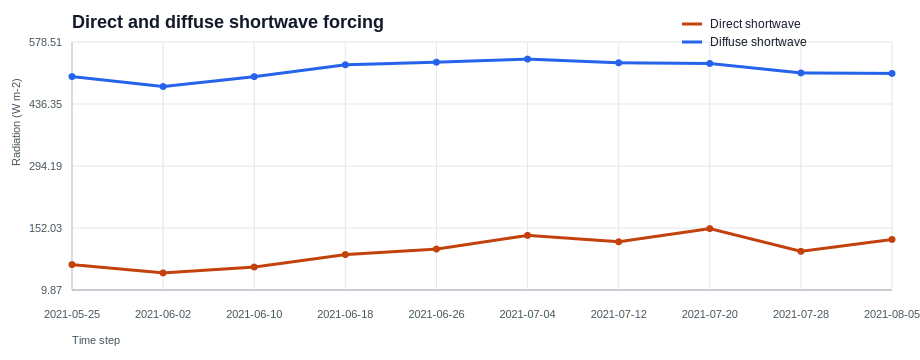
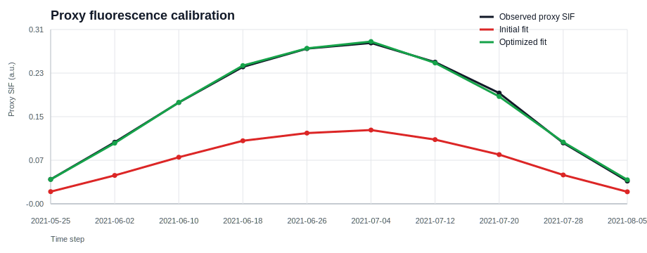

# Showcase Experiment

## Core-Dependency Showcase: Field Input Assembly for ARC-SCOPE

This page documents the repo's primary in-repo showcase: a deterministic experiment that assembles a SCOPE-shaped input package from ARC-like biophysical arrays, bundled field geometry, bundled local weather, observation geometry, and radiation partitioning.

**Verified here:** synthetic ARC-like inputs, bridge conversion, local weather ingestion, observation geometry, direct/diffuse radiation partitioning, and a proxy calibration step that exercises the optimisation stack.

**Not claimed here:** a validated full `scope-rtm` execution.

## What This Demonstrates

The showcase uses only the core package dependencies and the code paths already exercised in the repository. It demonstrates how ARC-SCOPE turns spatial biophysical arrays and field context into inspectable, time-aligned experiment inputs before any heavy SCOPE dependency is introduced.

## What This Does Not Demonstrate

- It does not execute `prepare_scope_dataset()` or `run_scope_simulation()`.
- It does not claim scientific validation of SCOPE outputs.
- Its calibration step fits a **proxy** fluorescence response, not a real SCOPE fluorescence product.

## Experiment Inputs

- Synthetic ARC-like `post_bio_tensor` and `scale_data` arrays with seasonal structure.
- The bundled Belgian test field polygon from `arc_scope.data.TEST_FIELD_GEOJSON`.
- A bundled local weather CSV sampled at Sentinel-2-like overpass times.
- Default nadir viewing geometry with `overpass_hour=10.5`.

## Workflow

1. Generate synthetic ARC-like biophysical and soil arrays.
2. Convert them to named xarray structures with `arc_arrays_to_scope_inputs()`.
3. Build observation geometry from the field centroid with `build_observation_dataset()`.
4. Load local weather through `LocalProvider`.
5. Partition shortwave radiation into direct and diffuse terms with `partition_shortwave()`.
6. Assemble a compact experiment dataset for diagnostics.
7. Fit a proxy fluorescence yield parameter with the scipy optimisation wrapper.

## Run It

```bash
pip install arc-scope
python3 -m arc_scope.experiments.showcase --output-dir ./showcase-output
```

If you are working from a repo checkout, [examples/05_showcase_experiment.py](https://github.com/MarcYin/ARCOPE/blob/main/examples/05_showcase_experiment.py) wraps the same packaged entry point.

## Outputs to Inspect

- `post_bio_da`: gridded biophysical inputs in physical units.
- `post_bio_scale_da`: phenology and soil parameters aligned to the field grid.
- `weather_ds`: time-indexed local forcing with SCOPE-style variable names.
- `observation_ds`: solar and viewing geometry at each overpass time.
- `timeseries.csv`: flattened experiment diagnostics for each date.
- `summary.json`: compact calibration metrics.

Files generated for this page:

- [summary.json](assets/showcase/summary.json)
- [timeseries.csv](assets/showcase/timeseries.csv)

## Published Summary

The generated [summary.json](assets/showcase/summary.json) file records:

- `n_time_steps`
- `peak_lai`
- `mean_direct_fraction`
- `mean_diffuse_fraction`
- `true_fqe`
- `initial_fqe`
- `optimized_fqe`
- `rmse_initial`
- `rmse_optimized`
- `relative_fqe_error_pct`

The Pages workflow regenerates these artifacts before each docs build so the charts and summary stay aligned with the current showcase code.

## Radiation Partition



## Proxy Calibration



## Why This Matters

This experiment validates the interface boundary where ARC-SCOPE is already strongest: spatial biophysical data assembly, field context, forcing alignment, and optimisation mechanics. It gives you a concrete artifact to inspect before you introduce `scope-rtm`, `torch`, ARC retrieval, or ERA5 downloads.

## Optional Extension: Full SCOPE Integration

If you have verified `scope-rtm` and `torch` installed, move next to the pipeline and SCOPE integration paths:

- [Quick Start](quickstart.md)
- [Architecture](architecture.md)
- [Pipeline API](api/pipeline.md)

## Failure Modes

- Missing weather columns or mismatched `var_map` entries.
- Time alignment mismatches between weather and observation timestamps.
- Invalid or empty field geometries.
- Unrealistic synthetic values that make the proxy calibration trivial or unstable.
